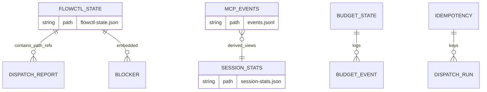

# DB Design — flowctl (artifact & cache)

**SRS Reference:** SRS Section 5

---

## 1. DBMS

**Không có RDBMS bắt buộc trong wiki.** Dữ liệu chủ yếu là **JSON / JSONL / file lock**.  
**TBD** — nếu triển khai tương lai lưu state trên PostgreSQL/SQLite (ngoài phạm vi wiki).

---

## 2. ERD (logical — file relationships)

> **Lưu ý:** Đây là quan hệ **logic** theo wiki, không phải schema SQL chuẩn.

---

## 3. Table / file list

| Name | Purpose |
|------|---------|
| `flowctl-state.json` | State workflow |
| `events.jsonl` | Log MCP |
| `session-stats.json` | Stats tổng hợp |
| `budget-state.json` | Breaker |
| `budget-events.jsonl` | Sự kiện budget |
| `idempotency.json` | Headless dispatch |
| `step-*-manifest.json` | Evidence hashes |

---

## 4. Table detail — `flowctl-state.json`

**Primary key:** **TBD** — file JSON tài liệu hóa như document root, không có PK đơn trường trong wiki.

| Field (đại diện) | Type | Constraints | Description |
|------------------|------|-------------|-------------|
| `current_step` | number | — | Wiki orchestration |
| `dispatch_risk` | object | — | `high_risk`, `impacted_modules`, `dispatch_count`, … |
| `steps` | object | — | Trạng thái từng bước |

**Indexes:** **N/A** (file JSON)

**Business rules:** Gate đọc status step + reports — wiki `gate.sh`.

---

## 5. Table detail — `events.jsonl`

Mỗi dòng: object JSON; field sử dụng: xem SRS §5 + wiki token-audit.

**Retention:** **TBD** — wiki không định nghĩa rotation log.
