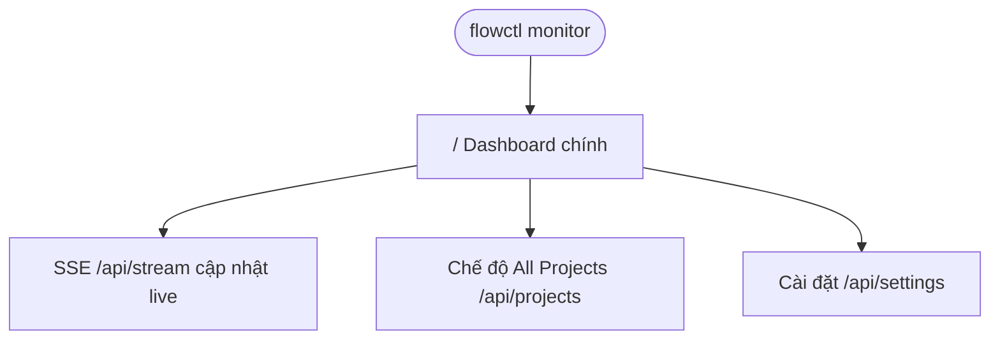

# Screen Map — flowctl

**SRS Reference:** SRS Section 4 (F-03), Section 6.1

---

## 1. Design System

| Hạng mục | Giá trị / ghi chú |
|----------|-------------------|
| Palette / Typography | **TBD** — UI nhúng trong `monitor-web.py`; wiki không mô tả design token. |
| Spacing / component library | **TBD** — không có design system riêng trong wiki. |

---

## 2. Navigation Flow



**ASCII tree (rút gọn):**

```
Monitor (localhost)
├── Trang chủ /
│   ├── Khối workflow (bước hiện tại, budget bar)
│   ├── Thống kê token / cache
│   └── Hoạt động gần đây
└── (Tuỳ chọn) All Projects — lưới project cards
```

---

## 3. Navigation Patterns

- **Primary:** SPA một trang, dữ liệu qua `fetch('/api/data')` + SSE.
- **Settings:** POST JSON merge `~/.flowctl/config.json` (wiki).
- **Deep link:** **TBD** — wiki không mô tả route hash cho từng view.

---

## 4. Role-based navigation

| User Role | Màn hình / quyền |
|-----------|------------------|
| Developer cục bộ | Toàn bộ dashboard tại `127.0.0.1` |
| Multi-tenant RBAC trên UI | **TBD** — wiki: không auth HTTP |

---

## 5. Screen Index

| Section ref | User Role | Purpose |
|-------------|-----------|---------|
| SCR-01 | Developer | Dashboard telemetry MCP + workflow |
| SCR-02 | Developer | (Tuỳ chọn) Aggregate All Projects |

---

## 6. Common UI Elements

- Bảng tools (sort theo số lần gọi), log calls, alerts (wiki).
- **TBD** — mô tả widget-level (button, modal) vì wiki chỉ mức hành vi.

---

## 7. Responsive breakpoints

**TBD** — wiki không liệt kê breakpoint; UI embedded HTML.
