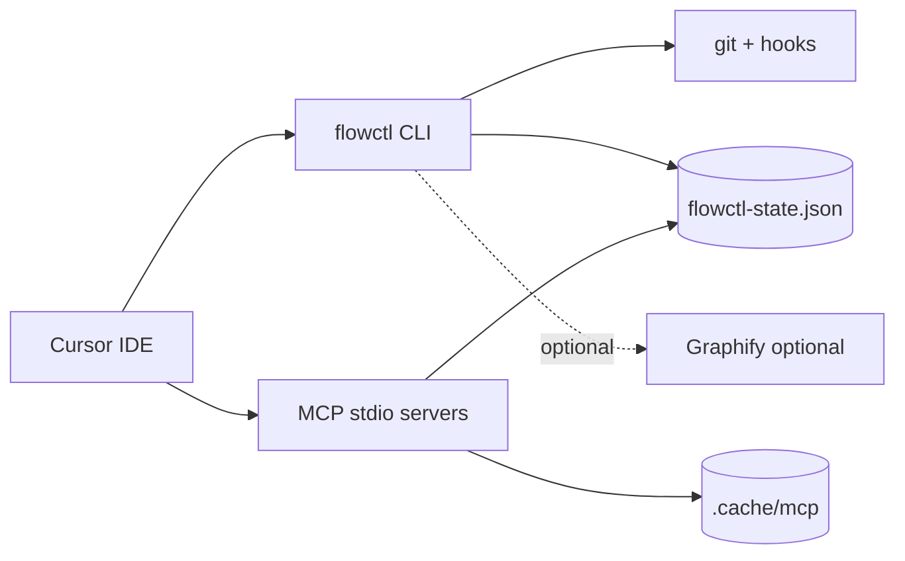

# Architecture Overview — flowctl

**SRS Reference:** Section 2.1  
**Basic Design:** `screen-map.md`, `api-list.md`

---

## 1. Overview

**Purpose:** Mô tả kiến trúc tĩnh từ wiki GitNexus cho flowctl.

**Architecture Principles (từ wiki, không thêm):**
- Bash-first CLI, Python nhúng cho JSON/lock
- MCP cho truy cập có cấu trúc, cache hợp nhất với telemetry
- Tách state team-shared vs artifact runtime máy

**Design Goals:**
- Giảm token context cho agent
- Enforce gate + evidence trước approve
- Vận hành được trên clone dev cục bộ

---

## 2. System Context

**External systems:** Cursor; Git; Graphify/GitNexus optional (setup.sh).

---

## 3. Container / process view

| Unit | Technology | Responsibility |
|------|------------|----------------|
| CLI | Bash | Router, export env |
| Engine libs | Bash + Python heredoc | Policy, dispatch, gate |
| shell-proxy | Node MCP | wf_* tools |
| workflow-state | Node MCP | flow_* → flowctl |
| monitor-web | Python stdlib HTTP | Telemetry UI |
| token-audit | Python | Offline analytics |

---

## 4. Tech stack

| Layer | Technology | Version |
|-------|------------|---------|
| Shell | bash | **TBD** minimum version |
| MCP SDK | `@modelcontextprotocol/sdk` | Theo `package.json` — **TBD pin** |
| Python | python3 | **TBD** minimum |

---

## 5. Design principles implementation

**TBD** — liên hệ cụ thể với SOLID từng module: ngoài phạm vi wiki; chỉ ghi nhận separation shell vs MCP vs monitor.
