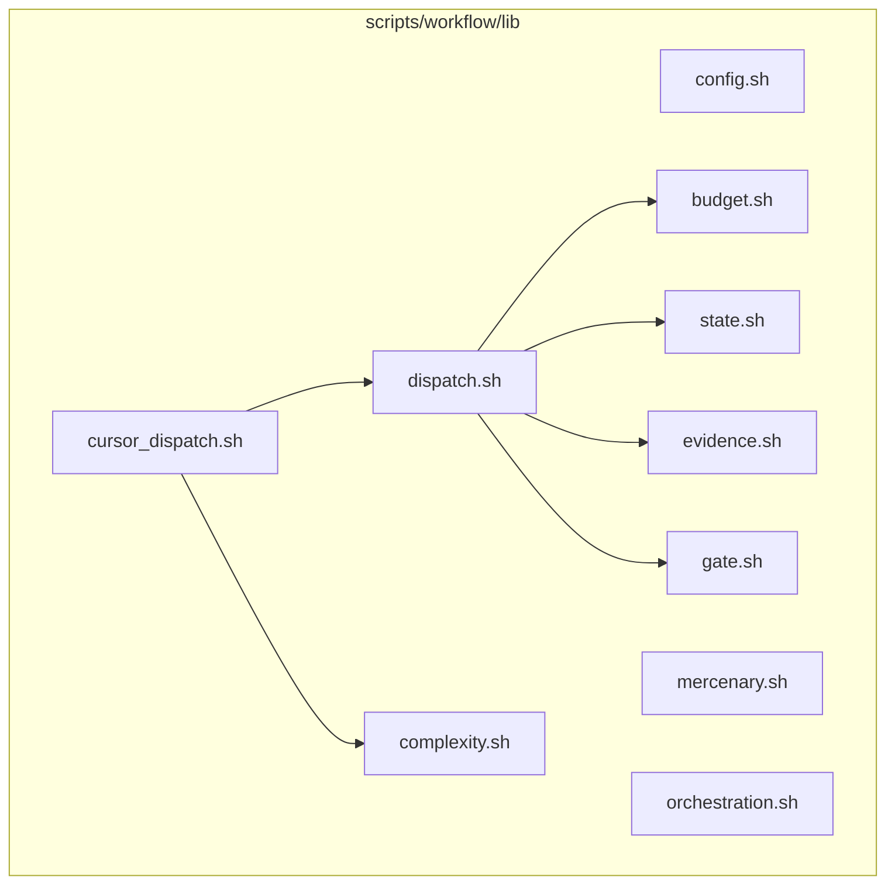
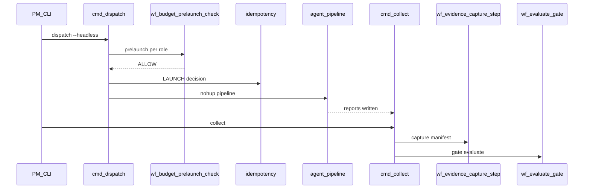

# F-01 — Feature Detail: Workflow orchestration engine

**SRS Reference:** SRS `features/f-01-workflow-orchestration-engine.md`  
**Basic Design:** `db-design.md`, `api-list.md` (CLI không REST)

---

## 1. Feature Overview

**Summary:** Runtime bash/Python nhúng trong `scripts/workflow/lib/*` thực thi vòng đời dispatch/collect/gate/budget/evidence/mercenary như wiki **Workflow orchestration engine**.

**Design decisions (trích wiki):**

| Decision | Rationale |
|----------|-----------|
| Embedded Python trong shell | JSON an toàn, locking, output có cấu trúc |
| Tách `FLOWCTL_RUNTIME_DIR` vs state trong repo | Clone song song, headless không bẩn git index |
| Budget breaker 3-state | Chống vượt cap token/runtime/cost |

**Dependencies:** `context_snapshot.py`, `stream_json_capture.py`, policy JSON.

---

## 2. Component Design

**Responsibilities:** Khớp mục wiki từng file `.sh` (không lặp toàn bộ nội dung wiki tại đây).

---

## 3. Sequence Diagrams

### 3.1 Primary — headless happy path

### 3.2 Alternative — War Room

**Condition:** `wf_complexity_score` ≥ `WF_WAR_ROOM_THRESHOLD` (default 4) và không `--skip-war-room` / `--merge`.

**Flow:** `cmd_war_room` → bump dispatch count — chi tiết bước con: **TBD — xem `war_room.sh` / wiki War Room page nếu cần**.

---

## 4. API Design

**N/A REST** — giao diện là CLI và file markdown. MCP tách F-02.

---

## 5. Database Design

Xem Basic Design `db-design.md` (JSON artifacts).

---

## 6. UI Design

**N/A** cho F-01 (CLI/brief). Dashboard thuộc F-03.

---

## 7. Security

- Lock file workflow giảm race (wiki `lock.sh`).
- Role policy chặn mode/`--trust` không hợp lệ → exit 2.

---

## 8. Integration

- `workflow-state` MCP gọi `flowctl` cùng thay đổi state.
- Git hooks (**F-06**): `invalidate-cache.sh`, `generate-token-report.py` — xem [f-06-git-hooks-detail.md](f-06-git-hooks-detail.md) và wiki `git-hooks-and-local-automation.md`.

---

## 9. Error Handling

| Code / signal | Ý nghĩa |
|---------------|---------|
| `POLICY_VIOLATION|…` | Role policy |
| `BLOCK|breaker=open` | Budget |
| `SKIP|…` | Idempotency |
| `EVIDENCE_FAIL|…` | Hash mismatch |
| Dispatch exit 1/2/255 | Bảng wiki |

---

## 10. Performance

- `--dry-run` dispatch: forecast budget không fork (wiki).
- **TBD** — SLO thời gian `collect` trên N báo cáo lớn.

---

## 11. Testing

**TBD** — wiki không liệt kê test case IDs; repo có `test:*` scripts (SRS §9).

---

## 12. Deployment

- Local dev / npm global: wiki overview.
- **TBD** — container image cho flowctl.

---

## 13. Monitoring

- `cmd_team monitor` — metrics text: idempotency PID, heartbeats, budget (wiki).
- **TBD** — Prometheus exporter.
