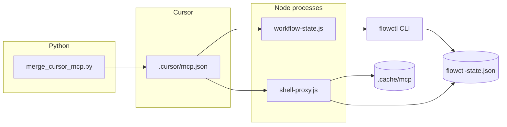
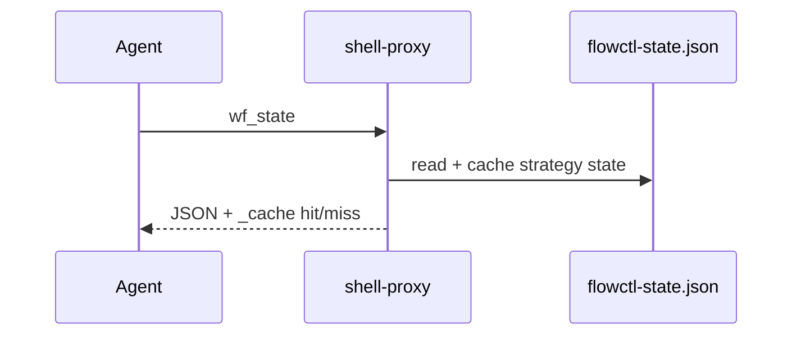
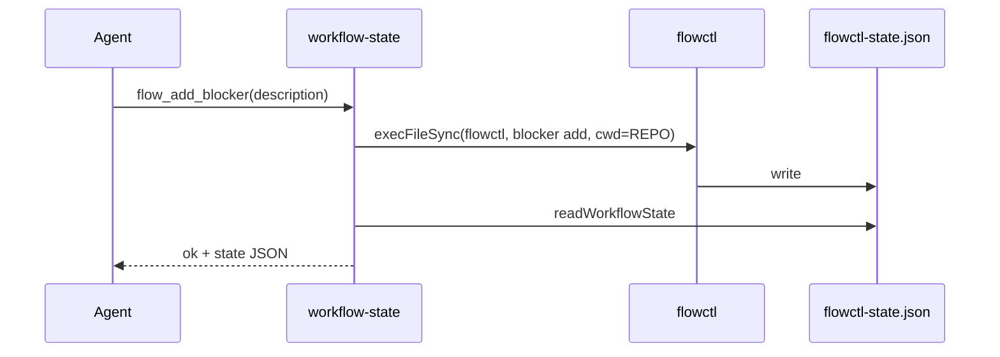

# F-02 — Feature Detail: MCP servers và merge Cursor MCP

**SRS Reference:** SRS `features/f-02-mcp-servers.md`  
**Basic Design:** `api-list.md`, `api-detail.md`

---

## 1. Feature Overview

**Summary:** Hai MCP server Node (**stdio**): `shell-proxy.js` (đọc/cache/ước lượng token) và `workflow-state.js` (mutation qua `flowctl`); cùng **`merge_cursor_mcp.py`** ghi/merge `mcpServers` vào `.cursor/mcp.json` và merge không phá hoại vào `~/.cursor/mcp.json` — wiki **MCP servers and Cursor MCP merge**.

**Design decisions (trích wiki):**

| Decision | Rationale |
|----------|-----------|
| `REPO = FLOWCTL_PROJECT_ROOT \|\| cwd` | Cursor có thể spawn không từ root repo |
| Cache strategies (`static`/`git`/`state`/`ttl`/`mtime`) | Khớp độ biến động dữ liệu |
| `withLogging` trừ `wf_set_agent`, `wf_cache_invalidate` | Token stats nhất quán |
| Merge không overwrite server trùng tên đã user chỉnh | Tránh clobber cấu hình tay |

**Dependencies:** `@modelcontextprotocol/sdk`, `flowctl` trên `PATH`, `flowctl-state.json`.

---

## 2. Component Design

**Files (wiki):** `scripts/workflow/mcp/shell-proxy.js`, `scripts/workflow/mcp/workflow-state.js`, `scripts/merge_cursor_mcp.py`.

---

## 3. Sequence Diagrams

### 3.1 Đọc state qua shell-proxy

### 3.2 Ghi state qua workflow-state

### 3.3 Merge MCP — project file mới

**Flow:** `merge_cursor_mcp.py` → nếu không có file / JSON rỗng → ghi template; in `MCP_STATUS=created` — wiki.

---

## 4. API Design

**Transport:** MCP stdio (không HTTP). **Tool catalog** (tên tool = MCP `name`):

**`wf_*` (shell-proxy):** `wf_state`, `wf_git`, `wf_step_context`, `wf_files`, `wf_read`, `wf_env`, `wf_reports_status`, `wf_set_agent`, `wf_cache_stats`, `wf_cache_invalidate` — hành vi/cache theo bảng wiki.

**`flow_*` (workflow-state):** `flow_get_state`, `flow_add_blocker`, `flow_add_decision`, `flow_advance_step`, `flow_request_approval` — delegate `flowctl`.

**JSON Schema đầy đừng từng tool:** **TBD** — lấy từ mảng `TOOLS` trong source nếu cần đính kèm spec.

---

## 5. Database Design

Không có DB SQL. File liên quan: `flowctl-state.json`, `<CACHE>/*.json`, `_gen.json`, `events.jsonl`, `session-stats.json`, `~/.flowctl/registry.json` — xem Basic Design `db-design.md`.

---

## 6. UI Design

**N/A** — không có UI sản phẩm; tương tác qua Cursor MCP panel.

---

## 7. Security

- Cả hai server phụ thuộc **máy dev tin cậy**; không có auth MCP trong wiki.
- `registryUpsert`: lock file `registry.json.lock` + backoff (wiki).
- **TBD** — rủi ro khi `FLOWCTL_PROJECT_ROOT` trỏ repo không tin cậy.

---

## 8. Integration

- `flowctl init` / `setup.sh` gọi merge với `--scaffold` vs `--setup` (wiki CLI).
- Sau ghi state/git quan trọng: agent gọi `wf_cache_invalidate` (wiki hướng dẫn sử dụng).

---

## 9. Error Handling

- MCP: `isError: true` + `{ error: ... }` (workflow-state wiki).
- Merge: exit `2`, `MCP_STATUS=invalid_json` / `invalid_structure`; stderr tiếng Việt khi JSON project invalid (wiki).

---

## 10. Performance

- Heuristic `estimateTokens` (không tiktoken) + `BASH_EQUIV` / `PRICE` hardcoded Sonnet-style (wiki).
- `invalidateAll`: scope `files` trong schema nhưng **chỉ** bump `git`/`state` generations — ghi chú wiki để tránh hiểu nhầm.

---

## 11. Testing

**TBD** — test tích hợp MCP trong repo (nếu có) chưa được liệt kê trong wiki.

---

## 12. Deployment

- Cursor đọc `mcp.json` local/global sau khi merge.
- `_resolve_cmd`: ưu tiên `~/.asdf/shims/<cmd>` rồi `which` (wiki).

---

## 13. Monitoring

- `wf_cache_stats`; events qua `logEvent` / `updateSessionStats` (wiki) — dashboard F-03 đọc cùng file.
