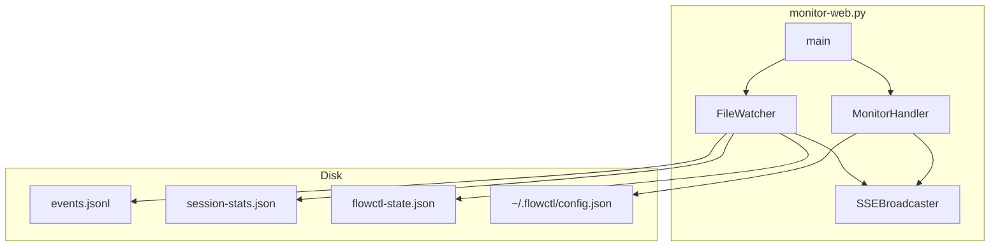
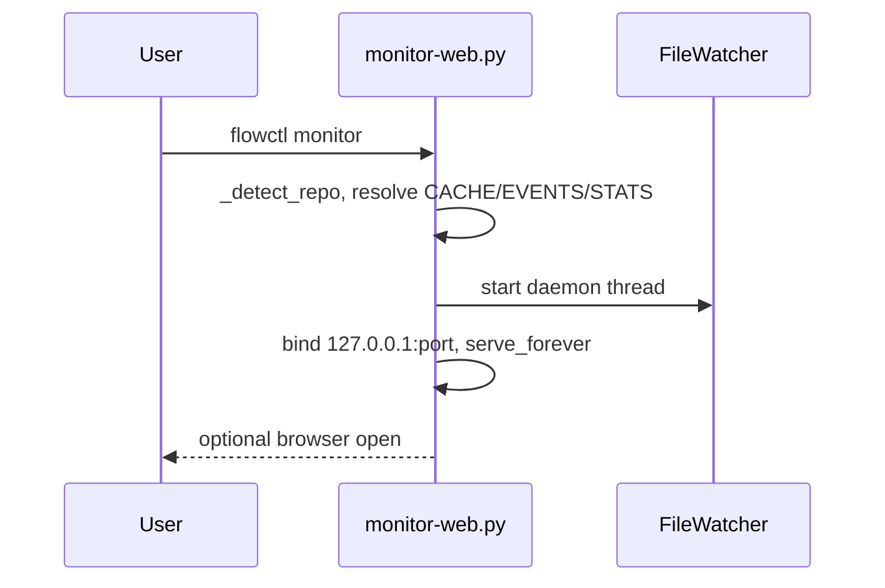
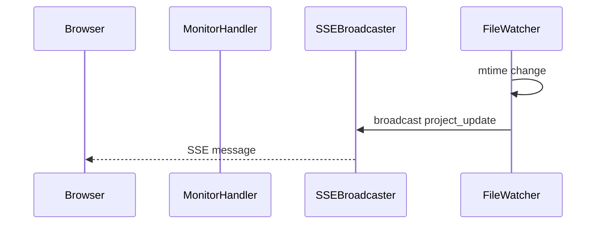
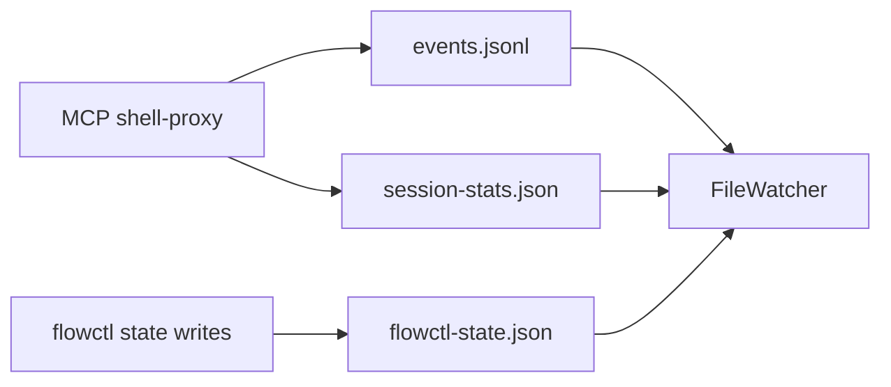

# F-03 — Feature Detail: Workflow telemetry dashboard

**SRS Reference:** SRS `features/f-03-telemetry-dashboard.md`  
**Basic Design:** `screen-map.md`, `screen-detail-monitor.md`, `api-list.md`, `api-detail.md`

---

## 1. Feature Overview

**Summary:** `scripts/monitor-web.py` — HTTP server cục bộ (`ThreadingHTTPServer` + thread daemon), đọc `session-stats.json`, `events.jsonl`, `flowctl-state.json`, đẩy cập nhật qua **SSE**; hỗ trợ **multi-project** qua `~/.flowctl/projects/*/meta.json` và `registry.json` — wiki **Workflow telemetry dashboard**.

**Design decisions (trích wiki):**

| Decision | Rationale |
|----------|-----------|
| `ThreadingMixIn` + `daemon_threads=True` | SSE dài không block route khác |
| `FileWatcher` ~200ms | Cân bằng độ trễ vs CPU |
| Bind `127.0.0.1` | Dev tool, không LAN mặc định |
| SSE queue `maxsize=50`, drop client chậm | Tránh backpressure |

**Dependencies:** File do shell-proxy ghi (`events.jsonl`, `session-stats.json`); `flowctl.sh` export env (v1.1+).

---

## 2. Component Design

---

## 3. Sequence Diagrams

### 3.1 Khởi động server

### 3.2 Client SSE

---

## 4. API Design

| Method | Path | Handler (wiki) |
|--------|------|----------------|
| GET | `/` | Inline HTML SPA |
| GET | `/api/data` | `json.dumps(build_api_data())` |
| GET | `/api/stream` | SSE `_sse_stream` |
| GET | `/api/projects` | `discover_projects` + `build_project_data` |
| GET | `/api/settings` | Đọc `~/.flowctl/config.json` |
| POST | `/api/settings` | Deep-merge body → config |
| GET | `/api/health` | `{"ok":true}` |

**Request/response schema chi tiết:** **TBD** — mở rộng từ source Python nếu cần hợp đồng strict.

---

## 5. Database Design

Không có RDBMS. Đọc/ghi JSON/JSONL như Basic Design §db-design.

---

## 6. UI Design

Embedded HTML: load `/api/data`, `EventSource('/api/stream')`, project switcher, merge tools/calls ở chế độ All Projects — wiki **Front-end behavior (high level)**.

Wireframe: Basic Design `screen-detail-monitor.md`.

---

## 7. Security

- Chỉ localhost; telemetry có prefix bash — wiki: host tin cậy, truncate UI.
- POST `/api/settings` không restart server — **TBD** hậu quả nếu config độc hại trên máy shared.

---

## 8. Integration

---

## 9. Error Handling

- `handle_error`: nuốt `ConnectionResetError` / `BrokenPipeError` / `ConnectionAbortedError` (wiki).
- `discover_projects` entry có thể có field `error` — hiển thị ở UI.

---

## 10. Performance

- Poll watcher 200ms; kiểm tra project khác mỗi N chu kỳ (500ms vs 200ms wiki).
- `check_alerts`: `cache_hit_rate_min` 0.65; bash waste threshold scale ×3 trên 20 event (wiki).

---

## 11. Testing

**TBD** — E2E Playwright cho dashboard nếu cần; wiki không nêu.

---

## 12. Deployment

- CLI: `--port`, `--once` (JSON stdout), `--global` (wiki).
- Port mặc định **3170**, thử `N..N+9`.

---

## 13. Monitoring

Bản thân module là công cụ quan sát; không có exporter metrics ngoài API JSON — **TBD** nếu tích hợp OpenTelemetry.
