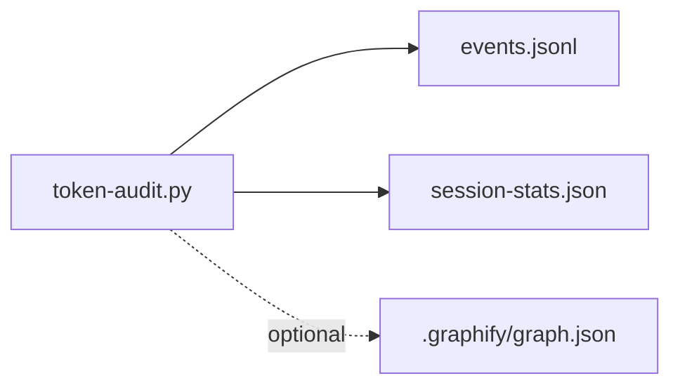
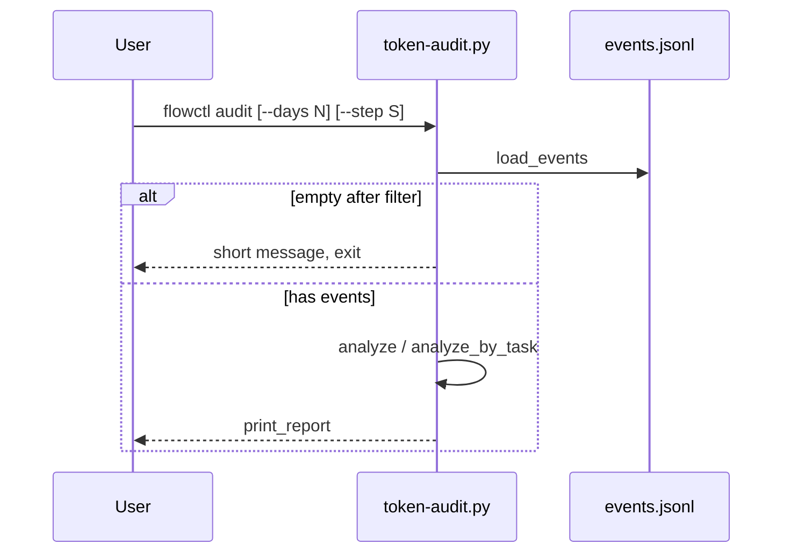

# F-04 — Feature Detail: Token usage auditing

**SRS Reference:** SRS `features/f-04-token-audit.md`  
**Basic Design:** `api-list.md` (N/A REST); dữ liệu: `db-design.md`

---

## 1. Feature Overview

**Summary:** CLI độc lập `scripts/token-audit.py` (wiki: lệnh `flowctl audit-tokens` / `audit`). Đọc **JSONL** MCP, tổng hợp token/cache/cost, phân loại **overhead** vs **work** (`OVERHEAD_TOOLS`), hỗ trợ nhóm theo task, định dạng báo cáo table/markdown/json/legacy, đọc **Graphify** graph health — wiki **Token usage auditing**.

**Design decisions (trích wiki):**

| Decision | Rationale |
|----------|-----------|
| Malformed JSONL line → skip silent | Không crash trên log bẩn |
| `OVERHEAD_TOOLS` cố định | So sánh overhead vs work nhất quán với shell-proxy naming |
| Graph path mặc định `<repo>/.graphify/graph.json` | Health check tùy chọn |

**Ghi chú wiki:** trang wiki có typo tên file `token-token-audit.py`; mã nguồn thực tế: `scripts/token-audit.py`.

**Dependencies:** `FLOWCTL_EVENTS_F`, `FLOWCTL_STATS_F`, optional Graphify file.

---

## 2. Component Design

---

## 3. Sequence Diagrams

### 3.1 Phân tích và in báo cáo

---

## 4. API Design

**N/A** — CLI stdout/stderr, không HTTP.

---

## 5. Database Design

Nguồn: JSONL events + JSON stats — field bảng wiki (`tool`, `output_tokens`, `saved_tokens`, `cache`, `ts`, `step`, keys task grouping).

**Retention log:** **TBD** — ngoài wiki.

---

## 6. UI Design

**N/A** — output terminal hoặc markdown file tùy flag (chi tiết flag: **TBD** từ `--help` source).

---

## 7. Security

- Đọc file local; không gửi mạng trong wiki.
- **TBD** — nếu `events.jsonl` chứa dữ liệu nhạy cảm, chính sách mask khi copy báo cáo.

---

## 8. Integration

- Cùng pipeline telemetry với `shell-proxy` / `log-bash-event.py` (ghi `events.jsonl`).
- Graphify: `graphify_status()` — **TBD** đồng bộ với `graphify-out/` nếu repo dùng layout khác `.graphify/`.

---

## 9. Error Handling

- Parse lỗi từng dòng JSONL: bỏ qua (wiki).
- Thiếu file events sau filter: thoát sớm không gọi `print_report()`.

---

## 10. Performance

Đọc toàn bộ `events.jsonl` vào memory trong `load_events()` — **TBD** giới hạn kích thước file / streaming cho log lớn.

---

## 11. Testing

**TBD** — fixture JSONL trong `tests/` nếu có.

---

## 12. Deployment

Kèm package flowctl; gọi qua `flowctl.sh` → `cmd_audit_tokens`.

---

## 13. Monitoring

Báo cáo ad-hoc; không có daemon — **TBD** lịch chạy định kỳ CI.
