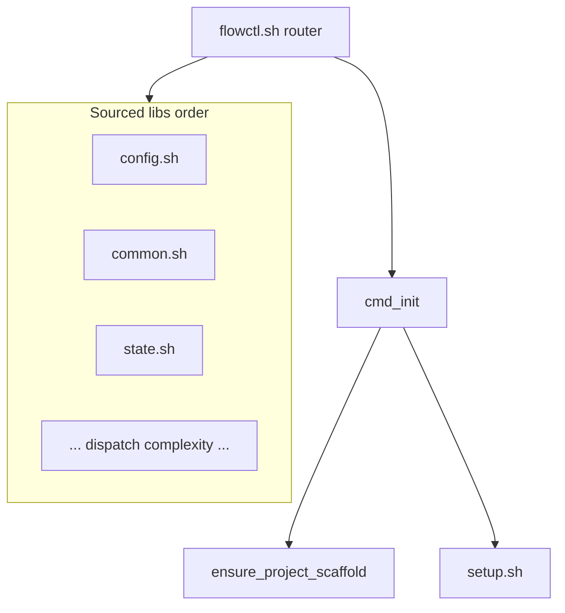
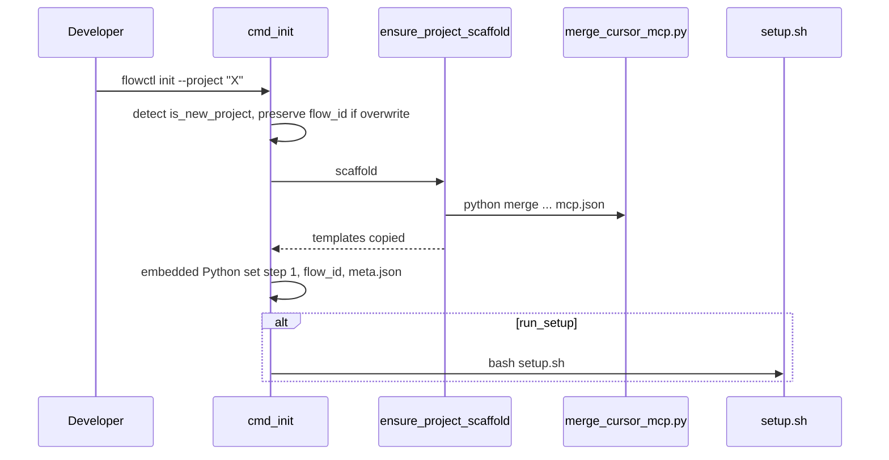

# F-05 — Feature Detail: CLI entry và project scaffold

**SRS Reference:** SRS `features/f-05-cli-scaffold.md`  
**Basic Design:** `db-design.md` (artifact scaffold tạo ra)

---

## 1. Feature Overview

**Summary:** `scripts/flowctl.sh` là **entrypoint**: resolve `WORKFLOW_ROOT` / `PROJECT_ROOT`, `set -euo pipefail`, export biến môi trường (`FLOWCTL_HOME`, cache paths, UTF-8 Python), **source** thư viện `scripts/workflow/lib/*.sh` theo **thứ tự cố định** (order là contract — wiki **CLI and project setup**). `ensure_project_scaffold` + `cmd_init` + tùy chọn `scripts/setup.sh` thiết lập state, MCP, policy, `.cursor`, meta `~/.flowctl/projects/`.

**Design decisions (trích wiki):**

| Decision | Rationale |
|----------|-----------|
| Lock `wf_acquire_flow_lock` trên tập lệnh ghi state | Tránh race đa terminal/CI |
| `flowctl_ensure_data_dirs` trừ `version`/`init`/`monitor`/`mcp`/`help` | Giảm side effect lệnh read-only |
| Giữ `flow_id` khi `--overwrite` | Không orphan `~/.flowctl/projects/*` |
| Init dùng `--scaffold` merge; `setup.sh` dùng `--setup` | Hai lớp cài đặt MCP khác nhau (wiki) |

**Dependencies:** `merge_cursor_mcp.py`, templates dưới `templates/`, `scripts/setup.sh`.

---

## 2. Component Design

Thứ tự source đầy đủ: wiki liệt kê `config.sh` → `common.sh` → `state.sh` → … → `reporting.sh`.

---

## 3. Sequence Diagrams

### 3.1 Init — project mới

### 3.2 Init vs setup (wiki)

Xem diagram `Init vs setup` trong wiki CLI — **đã phản ánh** trong section 1 (scaffold luôn; setup khi new/overwrite).

---

## 4. API Design

**CLI surface (rút gọn wiki):** `mcp`, `audit`/`audit-tokens`, `status`, `init`, `version`, `help`; cộng các lệnh router khác (`start`, `approve`, `dispatch`, …) trong libs.

**OpenAPI:** **TBD** — không áp dụng.

---

## 5. Database Design

Scaffold tạo/ghi: `flowctl-state.json`, `workflows/gates/qa-gate.v1.json`, policies, thư mục `workflows/gates/reports` — wiki `ensure_project_scaffold`.

---

## 6. UI Design

**N/A** — CLI stdout.

---

## 7. Security

- Không nhúng chuỗi user thô vào `python3 -c` — wiki: dùng env + heredoc cho `project_name`.
- Windows: `cygpath`-safe paths khi spawn Python.

---

## 8. Integration

- Gọi `invalidate-cache.sh state` sau một số luồng (`flowctl.sh` — wiki hooks doc cross-ref).
- `generate-token-report.py` sau approve (wiki git-hooks doc).

---

## 9. Error Handling

- Merge MCP exit 2: invalid JSON/structure — xử lý cảnh báo vs fatal theo nhánh wiki (`PermissionError` → skip merge).
- Skip presets: `hotfix`, `api-only`, … — wiki liệt kê; logic trong `cmd_skip`: **TBD** chi tiết từng preset trong detail design này.

---

## 10. Performance

**TBD** — thời gian `setup.sh` full pipeline (Graphify index).

---

## 11. Testing

`npm run test:gate:local` / `test:ci` qua hooks — liên kết F-06.

---

## 12. Deployment

- Global npm install: `flowctl.sh` pin `FLOWCTL_PROJECT_ROOT` cho monitor (wiki telemetry).
- **TBD** — cài đặt system-wide ngoài npm.

---

## 13. Monitoring

- `status --all`: đọc `~/.flowctl/registry.json` (wiki).
