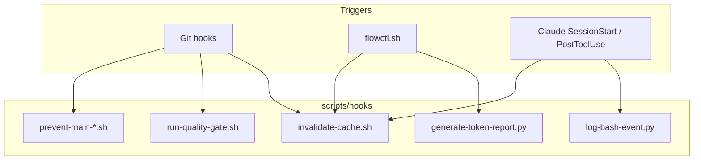
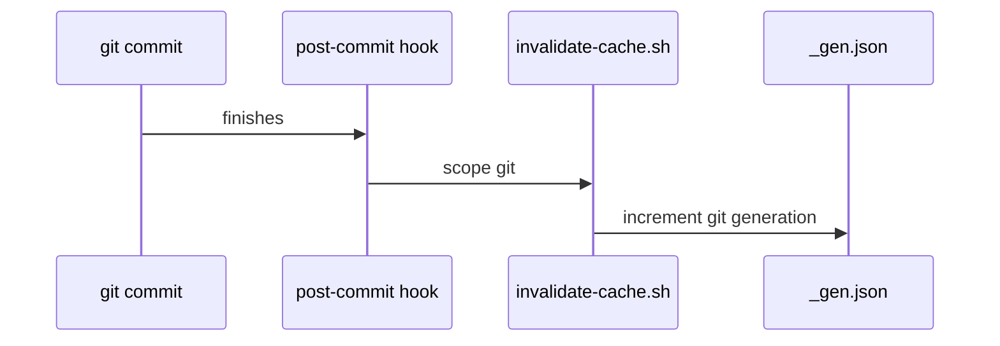
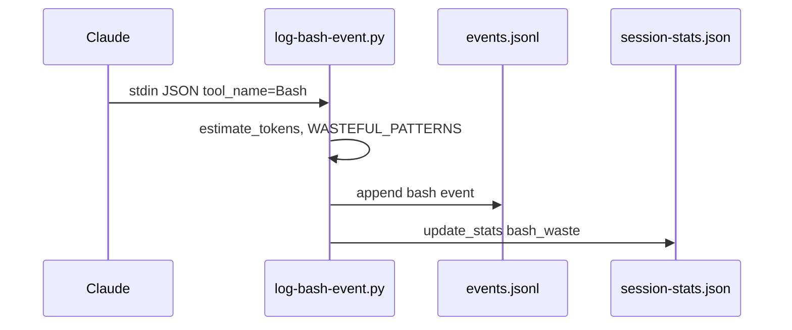

# F-06 — Feature Detail: Git hooks và automation cục bộ

**SRS Reference:** SRS `features/f-06-git-hooks.md`  
**Basic Design:** TBD màn hình — module chỉ CLI/hook

---

## 1. Feature Overview

**Summary:** Thư mục `scripts/hooks/` nối **bảo vệ nhánh** (`main`/`master`), **đồng bộ generation cache MCP** (`invalidate-cache.sh`), **quan sát token bash** (`log-bash-event.py`), **quality gate** (`run-quality-gate.sh`), **báo cáo token theo bước** (`generate-token-report.py`). Cài đặt qua `npm run setup-hooks` → `setup-git-hooks.mjs` ghi stub dưới `.git/hooks/` — wiki **Git hooks and local automation**.

**Design decisions (trích wiki):**

| Decision | Rationale |
|----------|-----------|
| `post-commit`/`merge`/`checkout` → `invalidate-cache.sh git` | Cache `wf_git` stale sau lịch sử git |
| `flowctl.sh` + Claude `SessionStart` → `invalidate-cache.sh state` | State JSON đổi |
| `log-bash-event.py` PostToolUse chỉ khi `tool_name == Bash` | Tránh noise |
| `pre-push` chạy quality gate **local** (`test:tdd`) | Nhẹ hơn CI |

**Dependencies:** `npm` scripts trong `package.json`; `.claude/settings.json` cho Claude hooks.

---

## 2. Component Design

---

## 3. Sequence Diagrams

### 3.1 post-commit → invalidate cache

### 3.2 log-bash-event (PostToolUse)

---

## 4. API Design

**N/A** — hooks là process invocation, không REST.

---

## 5. Database Design

- `_gen.json` dưới `.cache/mcp` — counters `git`/`state` (wiki invalidate).
- `events.jsonl`, `session-stats.json` — ghi bởi `log-bash-event.py`.
- Output `workflows/dispatch/step-{N}/token-report.md` + archive stats — wiki `generate-token-report.py`.

---

## 6. UI Design

**N/A** — stderr warning khi phát hiện bash waste.

---

## 7. Security

- `prevent-main-*`: giảm rủi ro push/commit trực tiếp nhánh protected.
- Hooks `post-*` nuốt lỗi invalidate để **không block** thao tác git (wiki).

---

## 8. Integration

- **F-02:** `_gen.json` tiêu thụ bởi `shell-proxy.js`.
- **F-05:** `flowctl.sh` gọi invalidate sau `start`/approve/skip… (wiki bảng caller).
- **F-01:** `generate-token-report.py` sau approve (bước workflow).

---

## 9. Error Handling

- `invalidate-cache.sh`: scope `files` trong usage nhưng **không bump** counter trong body hiện tại — wiki cảnh báo triển khai.
- Quality gate: `local` → `npm run test:tdd`; `ci` → `npm run test:ci:core`.

---

## 10. Performance

Hooks phải nhanh; invalidate + Python log append — **TBD** ngưỡng timeout hook nếu repo chậm.

---

## 11. Testing

Đổi tên script trong `package.json` phải đồng bộ `run-quality-gate.sh` (wiki Contributing).

---

## 12. Deployment

`npm run setup-hooks` sau clone hoặc khi đổi `setup-git-hooks.mjs`.

---

## 13. Monitoring

- Báo cáo `token-report.md` per step.
- Telemetry tiếp tục trên F-03.
