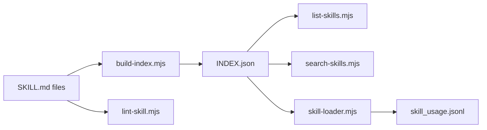
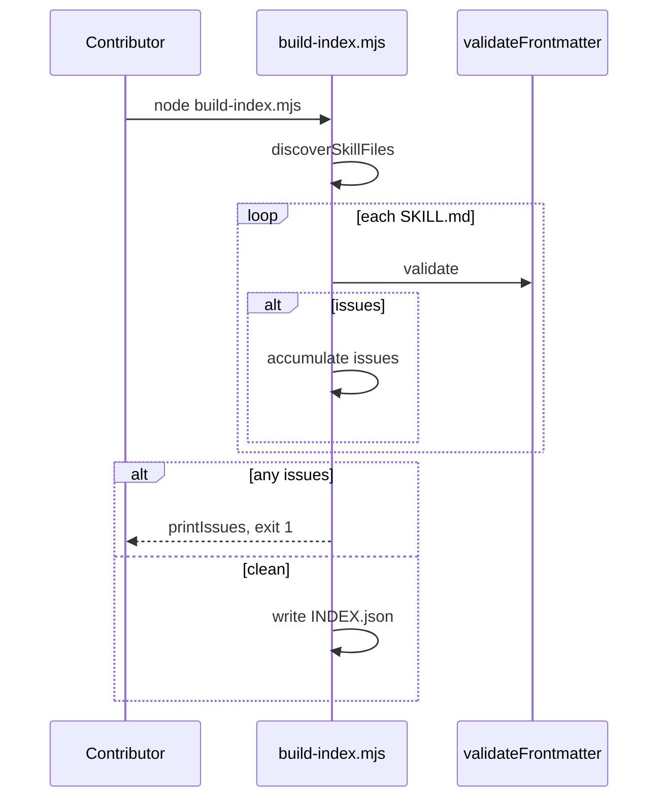
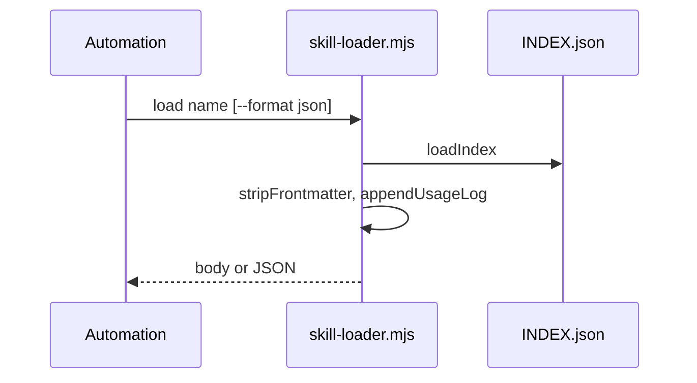

# F-07 — Feature Detail: Skills catalog tooling

**SRS Reference:** SRS `features/f-07-skills-catalog.md`  
**Basic Design:** TBD — contract tại `docs/skill-contract.md` (wiki cross-ref)

---

## 1. Feature Overview

**Summary:** Node scripts trong `scripts/workflow/skills/`: phát hiện `SKILL.md` dưới `.cursor/skills/core/**` và `extended/**`, parse/validate frontmatter, build **`INDEX.json`**, lint, list/search có rank, load body + ghi **usage log** — wiki **Skills catalog tooling**. Logic dùng chung `skill-utils.mjs`.

**Design decisions (trích wiki):**

| Decision | Rationale |
|----------|-----------|
| `name` kebab-case unique | Catalog ổn định cho automation |
| `build-index` exit 1 nếu có bất kỳ issue | Fail closed |
| `search-skills` heuristic score | Tìm skill phù hợp không cần embedding |
| Usage log `.flowctl/skill_usage.jsonl` | Chỉ từ `skill-loader.mjs` |

**Dependencies:** `package.json` version cho `builder_version`; `docs/skill-contract.md` đồng bộ contract.

---

## 2. Component Design

---

## 3. Sequence Diagrams

### 3.1 Build index

### 3.2 Load skill

---

## 4. API Design

**CLI (Node):** `build-index.mjs`, `lint-skill.mjs`, `list-skills.mjs`, `search-skills.mjs`, `skill-loader.mjs` — tham số `--project-root`, `--format`, filters `--role`/`--tag`/`--trigger`, `--limit` (wiki).

**TBD** — bảng đầy đủ flag từ `--help` từng script.

---

## 5. Database Design

- Output: `.cursor/skills/INDEX.json` (JSON catalog).
- Log: `.flowctl/skill_usage.jsonl` (append-only).

---

## 6. UI Design

**N/A** — CLI/table/json stdout.

---

## 7. Security

- Đọc file trong repo — **TBD** path traversal checks trong `readSkill`.

---

## 8. Integration

- **F-05:** `ensure_project_scaffold` đảm bảo tồn tại `.cursor/skills` (wiki).
- **Docs:** `docs/skill-contract.md`, `.cursor/skills/README.md` (wiki).

---

## 9. Error Handling

- Frontmatter không có `---` đóng/mở đúng → throw, báo line 1 (wiki).
- `loadIndex` thiếu file → throw kèm hướng dẫn chạy build-index (wording trong `skill-utils.mjs` — **TBD** quote chính xác).

---

## 10. Performance

Walk recursive `SKILL.md` — **TBD** giới hạn số file lớn monorepo.

---

## 11. Testing

**TBD** — snapshot `INDEX.json` golden test nếu có trong repo.

---

## 12. Deployment

Chạy `node …/script.mjs` khi không có executable bit; CI có thể gọi `lint-skill` + `build-index` trước merge.

---

## 13. Monitoring

Usage log JSONL có thể phân tích ngoài band — **TBD** dashboard cho skill usage.
