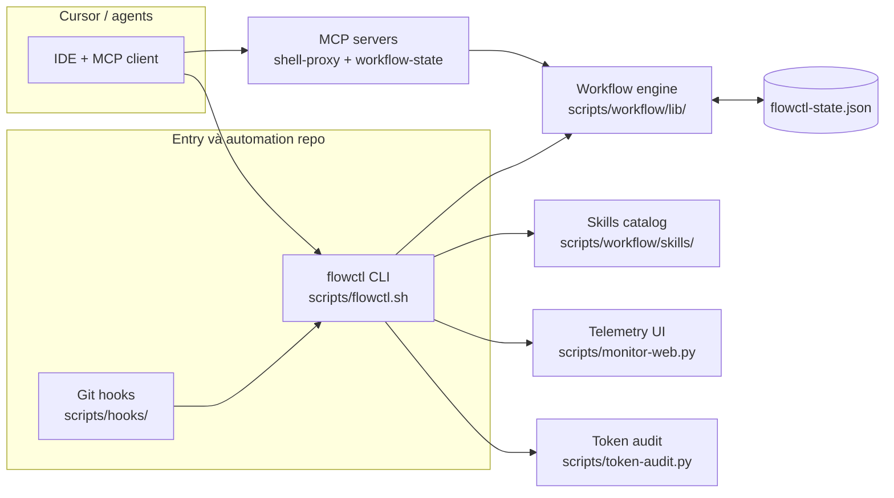

## 2. Overall Description

### 2.1 Product Perspective

**Product Context:**  
flowctl là bộ **CLI + thư viện bash** đóng gói trong repo workflow, chạy trong môi trường phát triển (Cursor + agent). Không phải SaaS độc lập; lõi runtime nằm ở `scripts/workflow/lib/`, entrypoint `scripts/flowctl.sh`.

**System Relationships:**
- **Cursor IDE:** khởi MCP client, đọc `.cursor/mcp.json`
- **flowctl CLI:** gọi engine, cập nhật `flowctl-state.json`
- **MCP servers:** `shell-proxy.js`, `workflow-state.js` (stdio, SDK MCP)
- **Git / hooks:** chính sách nhánh, quality gate cục bộ
- **Graphify / GitNexus:** wiki nêu là optional trong setup; engine nhúng hướng dẫn GitNexus cho bước code 4–8 trong brief

**Context Diagram** (theo wiki `overview.md`, điều chỉnh nhãn tiếng Việt):

### 2.2 User Classes and Characteristics

| User Class | Description | Characteristics | Priority |
|------------|-------------|-----------------|----------|
| Operator / Developer | Chạy `flowctl`, đọc state, monitor | Bash, Python 3, Node/npm theo wiki | Primary |
| PM / Orchestrator | Dispatch, collect, gate, approve | Hiểu bước workflow 1–9, artifacts `workflows/dispatch/` | Primary |
| Agent AI | Gọi MCP `wf_*`, `flow_*` | Ưu tiên công cụ có cache thay shell thô | Secondary |
| DevOps / Maintainer | CI, hooks, merge MCP | Cấu hình `mcp.json`, gate local | Secondary |

### 2.3 Operating Environment

**Hardware Platform:**  
TBD — wiki không chỉ định phần cứng tối thiểu; mặc định máy dev.

**Operating Systems:**
- macOS / Linux (wiki: bash-first; `osascript` cho `--launch` chỉ Darwin)
- Windows: wiki đề cập chuẩn hóa đường dẫn MSYS trong `monitor-web.py` — **TBD mức hỗ trợ chính thức toàn CLI** vì wiki không liệt kê ma trận OS đầy đủ

**Software Components (theo wiki):**
- `bash`, **Python 3** + pip (Graphify / script Python nhúng)
- **Node** + **npm** (MCP JS, GitNexus-related)

### 2.4 Design and Implementation Constraints

**Technology Constraints:**
- **Ngôn ngữ:** Bash (`set -euo pipefail`), Python nhúng trong shell, Node (MCP)
- **State:** JSON `flowctl-state.json`; cache MCP dưới `.cache/mcp` hoặc `FLOWCTL_CACHE_DIR`
- **Transport MCP:** stdio (`StdioServerTransport`)

**Corporate/Regulatory Policies:**  
TBD — wiki repo không mô tả compliance tổ chức.

### 2.5 Assumptions and Dependencies

**Assumptions:**
- Repo có `flowctl-state.json` hoặc sẽ được scaffold bởi `init` / template
- Cursor (hoặc MCP client tương thích) khi dùng MCP merge

**Dependencies:**
- `flowctl` trên `PATH` cho `workflow-state.js` (`execFileSync`)
- File policy `workflows/policies/*.json`, gate `workflows/gates/qa-gate.v1.json` (seed khi init nếu thiếu — theo wiki CLI)
