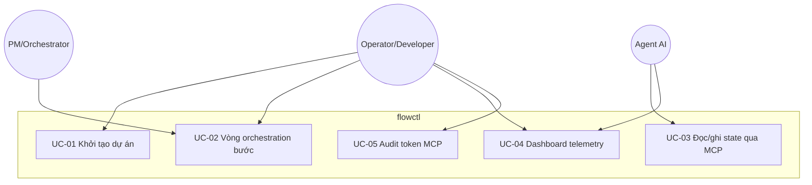

## 3. Use Cases

### 3.1 Use Case Diagrams

**System Context Diagram** (actor ↔ khối chức năng chính):

### 3.2 List Use Case

| Use Case ID | Use Case Name | Actor(s) | Priority | Status | Link to Detail |
|-------------|---------------|----------|----------|--------|----------------|
| UC-01 | Khởi tạo và scaffold dự án (`init`, MCP, policy) | Developer | High | Draft | [Chi tiết](use-cases/uc-01-khoi-tao-du-an.md) |
| UC-02 | Chạy vòng orchestration bước (complexity → dispatch → collect → gate) | PM, Developer | High | Draft | [Chi tiết](use-cases/uc-02-vong-orchestration.md) |
| UC-03 | Đọc/ghi trạng thái workflow qua MCP | Agent, Developer | High | Draft | [Chi tiết](use-cases/uc-03-mcp-workflow-state.md) |
| UC-04 | Quan sát telemetry cục bộ (monitor web) | Developer | Medium | Draft | [Chi tiết](use-cases/uc-04-dashboard-telemetry.md) |
| UC-05 | Audit sử dụng token / MCP events | Developer | Medium | Draft | [Chi tiết](use-cases/uc-05-audit-token.md) |

**Use Case Relationships:**

| Use Case | Relationship Type | Related Use Case | Description |
|----------|-------------------|-----------------|-------------|
| UC-02 | includes | UC-01 | Cần state và scaffold policy/gate trước khi vận hành đầy đủ |
| UC-03 | extends | UC-02 | Agent thay thế một phần thao tác shell bằng MCP trong cùng workflow |
| UC-04 | extends | UC-03 | Dashboard đọc cùng nguồn telemetry mà shell-proxy ghi |
